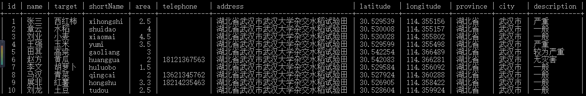

ARCoreLand实现说明

MySQL中的数据字段如下：

包含了主要的地块信息，其中：

name:表示户主信息；

target：农作物信息，也是农业保险标的；

latitude:地块中心点经度；

longitude:地块中心点纬度；

shortName:农作物的中文名称汉语拼音，用于和对应的图片进行对应，为农作物选择对应的图形。

客户端请求服务器的基本格式：

<http://domain:port/?lat=30.530470308356893&lon=114.35547166898954&radius=100>

Node.js返回给客户端的数据就是数据库中记录的Json格式。
